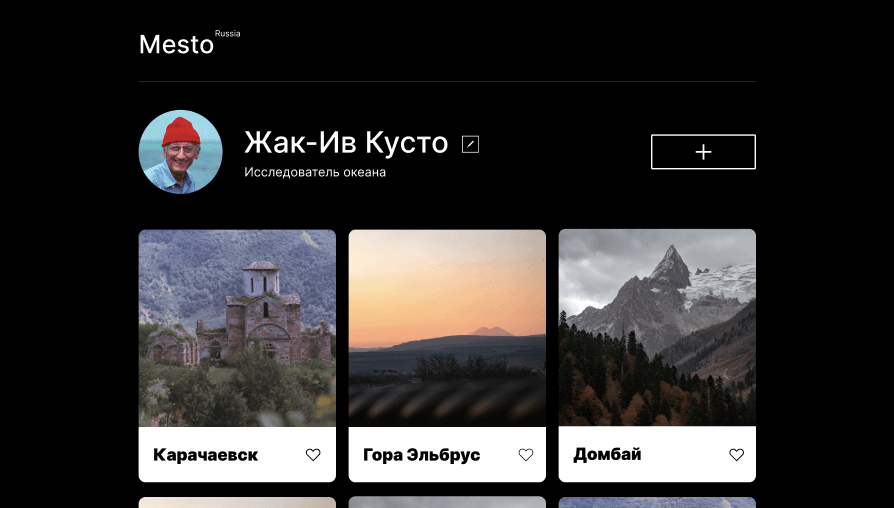

# Проект: Место-React

     

Данный проект представляет собой Веб-страницу с информацией о природных объектах на территории России, которые можно порекомендовать для посещения в качестве туриста. На данный момент посетитель может редактировать информацию об авторе публикации.
Основная цель данного проекта - портировать созданный ранее проект "Место" на React, применив полученные в ходе обучения знания на практике.

## В проекте использованы  технологии:

- HTML
- CSS
- JavaScript
- React
- API
- BEM
- Figma

## Инструкция по установке:
1. Клонировать репозиторий 
`git clone https://github.com/DmitryKazancev/mesto-react-auth`
2. Установить зависимости
`npm install`
3. Запустить локально
`npm start`

## 🔗 Ссылка на проект:
[Проект: Место-React](https://dmitrykazancev.github.io/mesto-react-auth/)

## 🚀 Обо мне
Студент Яндекс Практикума.

